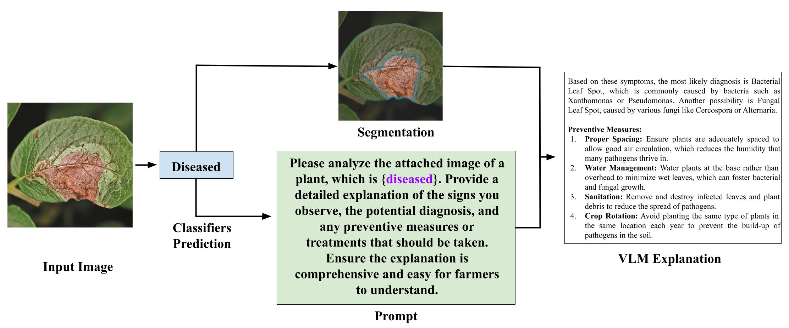

# Leaf-Expert
Leaf-Expert is an AI-powered tool that predicts leaf issues, provides detailed explanations, and offers actionable solutions to cure and prevent plant ailments. Perfect for researchers and gardeners, it combines advanced machine learning with practical plant care insights.

## Architecture Overview:
A hybrid explainer model designed to differentiate between plant diseases and non-diseases. It provides comprehensive insights by generating labels, masks, and captions for each image, facilitating a deeper understanding of plant health. The model integrates advanced computer vision techniques to enhance accuracy and interpretability, making it a valuable tool for agricultural researchers and practitioners.

## Example 

  

## TODOs
- [x] Adding Image Classifier (Development Interface).
- [x] Adding Explainer.
- [ ] Adding VLM.
- [ ] Integrating the Flow
- [ ] Add Demo
- [ ] Deploy

