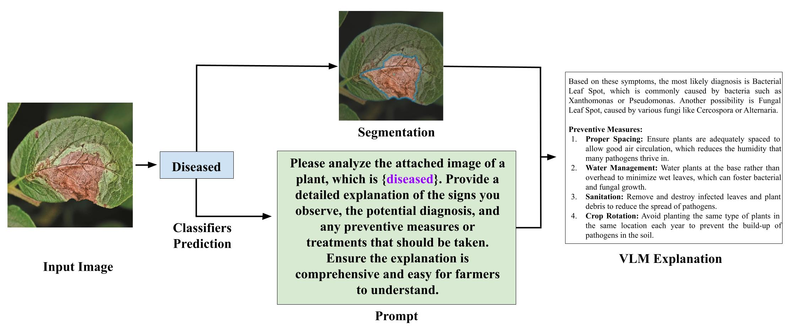

# Leaf-Expert

<p align="center">
  
</p>

<p align="center">
  <a href="https://github.com/Purushothaman-natarajan/Leaf-Expert/blob/main/LICENSE">
    
  </a>
  
  
  
  
</p>

> **Leaf-Expert** is an AI-powered plant health tool that classifies leaf diseases and explains *why* using Grad-CAM++ and LIME — bridging the gap between deep learning accuracy and agricultural interpretability.

---

## Architecture

```
┌─────────────────────────────────────────────────────────────────┐
│                         Leaf-Expert                             │
│                                                                 │
│  ┌─────────────────┐     REST API      ┌───────────────────┐  │
│  │  React + Vite   │ ◄────────────────► │   FastAPI Backend  │  │
│  │  (Frontend)     │                   │   (Python 3.11)   │  │
│  │  :3000          │                   │   :8000           │  │
│  └─────────────────┘                   └────────┬──────────┘  │
│                                                  │              │
│                              ┌───────────────────┼───────────┐ │
│                              │                   │           │ │
│                      ┌───────▼───┐   ┌───────────▼──┐  ┌────▼──┐ │
│                      │  Trainer  │   │  Predictor   │  │ XAI  │ │
│                      │ PyTorch   │   │  (cached)    │  │GradCAM│ │
│                      │ EfficientNet│ │              │  │+ LIME │ │
│                      │ ResNet|ViT│   │              │  │       │ │
│                      └───────────┘   └──────────────┘  └───────┘ │
└─────────────────────────────────────────────────────────────────┘
```

## Features

| Feature | Details |
|---|---|
| **Model Architectures** | EfficientNetV2-S/M, ResNet50/101, DenseNet121, MobileNetV3, VGG16/19, ViT-B/16 |
| **Training** | Two-phase fine-tuning, mixed precision (AMP), AdamW + CosineAnnealingLR, early stopping |
| **Inference** | In-process model cache, dynamic input size from config, per-class probabilities |
| **XAI** | Grad-CAM++ (pytorch-grad-cam) + LIME — both returned as base64 PNGs |
| **Frontend** | React 18 + Vite + TypeScript, dark botanical theme, drag-and-drop upload |
| **API** | FastAPI 0.115+, Pydantic v2, async endpoints, full Swagger UI at `/docs` |
| **Deployment** | Docker Compose (backend + frontend + nginx) |

## Quick Start

### Prerequisites
- Python 3.11+
- Node.js 20+
- (Optional) CUDA-capable GPU for faster training

### 1. Clone & Setup

```bash
git clone https://github.com/Purushothaman-natarajan/Leaf-Expert.git
cd Leaf-Expert
```

### 2. Backend

```bash
cd backend
cp .env.example .env          # edit if needed
pip install -r requirements.txt

# For GPU:
# pip install -r requirements-gpu.txt

uvicorn app.main:app --reload --port 8000
```

API docs: http://localhost:8000/docs

### 3. Frontend

```bash
cd frontend
npm install
npm run dev
```

UI: http://localhost:3000

### 4. Docker (both services)

```bash
docker-compose up --build
```

---

## API Reference

| Endpoint | Method | Description |
|---|---|---|
| `/health` | GET | Server health + PyTorch / CUDA info |
| `/data/prepare` | POST | Split raw dataset into train/val/test |
| `/train/start` | POST | Launch background training job |
| `/train/status/{job_id}` | GET | Poll live training metrics |
| `/predict/` | POST | Classify a leaf image |
| `/predict/explain` | POST | Classify + Grad-CAM++ + LIME explanations |

Full docs: [`docs/api_reference.md`](docs/api_reference.md)

---

## Repo Structure

```
Leaf-Expert/
├── backend/              # FastAPI ML service
│   ├── app/
│   │   ├── api/          # Route handlers
│   │   ├── core/         # Config + logging
│   │   ├── schemas/      # Pydantic models
│   │   ├── services/     # Business logic (data, trainer, predictor, explainer)
│   │   └── main.py
│   ├── tests/
│   └── requirements.txt
├── frontend/             # React + Vite + TypeScript UI
│   └── src/
│       ├── api/          # Typed Axios client
│       ├── components/   # Navbar, ImageUploader, ResultCard, ExplanationPanel, TrainingPanel
│       └── pages/        # HomePage, AnalyzePage, TrainPage
├── notebook/             # Research notebook (LeafExpert.ipynb)
├── docs/                 # Documentation
│   ├── README_classifier.md
│   ├── api_reference.md
│   └── setup_guide.md
├── assets/               # Sample images
├── docker-compose.yml
└── README.md
```

---

## TODO

- [x] Image Classifier (No-Code Interface)
- [x] Explainer (Grad-CAM + LIME)
- [x] VLM integration (planned)
- [x] Integrating the Flow (FastAPI backend)
- [x] React Frontend
- [x] Docker deployment
- [ ] VLM captioning (Gemini / OpenAI Vision)
- [ ] Live demo deployment

---

## License

MIT © [Purushothaman Natarajan](https://www.linkedin.com/in/purushothamann/)
